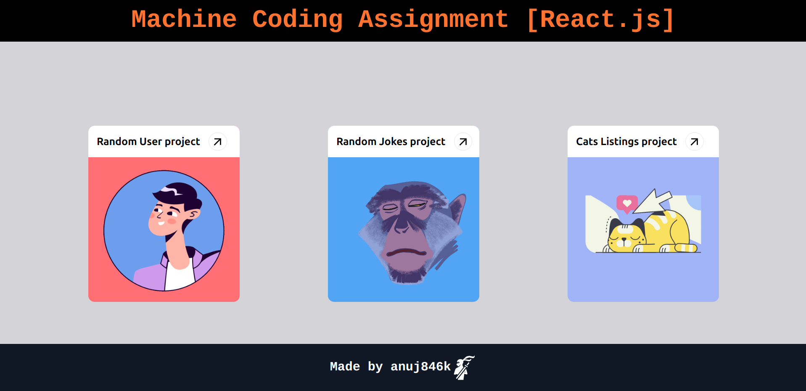
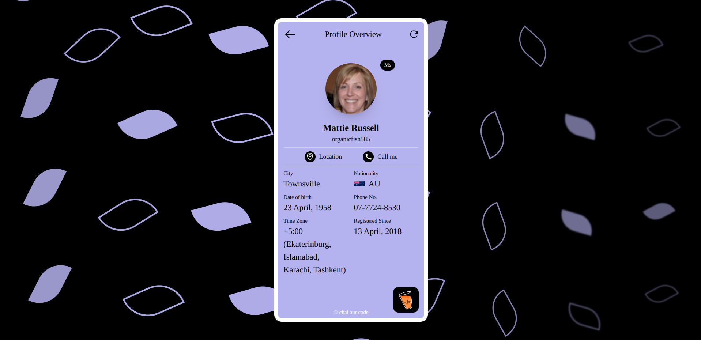
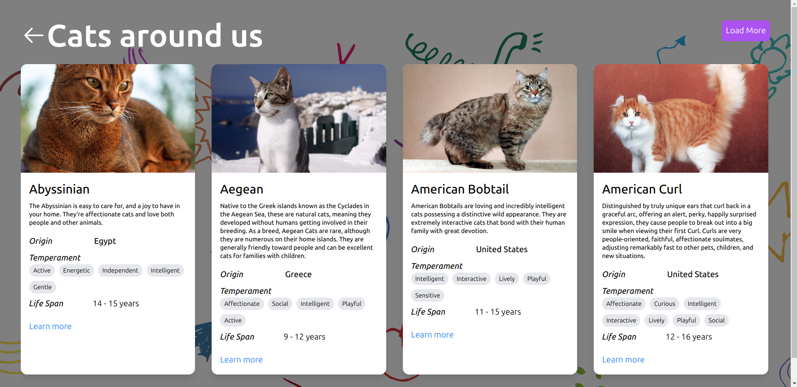

# Machine Coding Assignment [React.js]

This React project demonstrates the implementation of three different components, each fetching and displaying data from various APIs. The project includes random user profiles, random jokes displayed as tweets, and a paginated list of cat information.

## Home Page



## Live Demo

[[Link to  hosted website](https://machine-coding-react-js.vercel.app/)e]

## Features

1. **Random User Profile**
   

   - Styled component matching Figma design
   - Refresh button to fetch new random user data
   - Custom loading state
   - Hyperlinked location and call actions
   - API: https://api.freeapi.app/api/v1/public/randomusers/user/random

2. **Random Jokes Tweet**
   

   - Static tweet author details (Elon Musk)
   - Randomly generated tweet metadata (timestamp, views, date, analytics)
   - Custom loading state
   - New joke fetched on page reload
   - API: https://api.freeapi.app/api/v1/public/randomjokes/joke/random

3. **Cats Listing**
   

   - Horizontally scrolling, paginated list of cat information cards
   - Custom loading state for cards
   - API: https://api.freeapi.app/api/v1/public/cats?page=1&limit=4
   - Pagination implemented to fetch all available cat records

## Routes

- `/random-user`: Random User Profile component
- `/random-jokes`: Random Jokes Tweet component
- `/cats-listing`: Cats Listing component
- `/`: Redirects to `/`

## Additional Features

- Chai branding logo positioned as per design, linking to chaiaurcode.com
- React components precisely match provided Figma designs

## Getting Started

To run this project locally:

1. **Clone the Repository**
   ```bash
   git clone https://github.com/anuj846k/MachineCoding-React.js-
   ```

## Contributing

If you would like to contribute to this project, please feel free to submit a pull request or open an issue.
